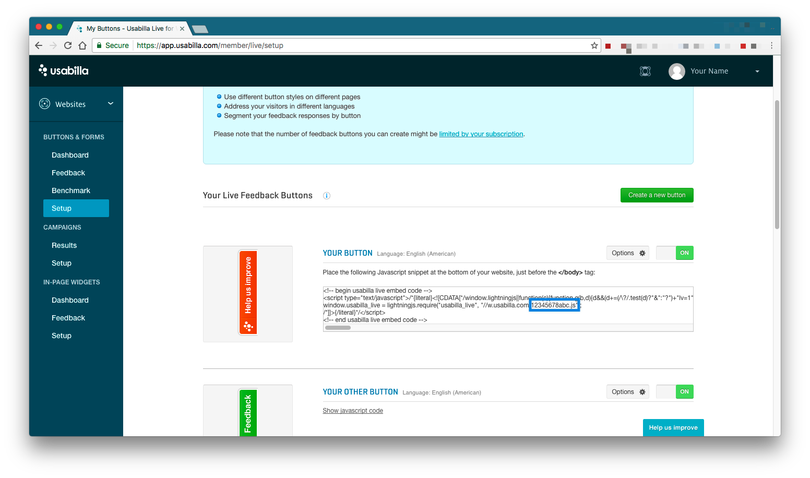

# gitbook-plugin-usabilla
[Usabilla](http://usabilla.com) for Gitbook

### How to use?

Add plugin to your `book.json`, then run `gitbook install`:

```json
{
    "plugins": ["usabilla"]
}
```

#### Configure usabilla token:



```json
{
    "plugins": ["usabilla"],
    "pluginsConfig": {
        "usabilla": {
            "usabillaId": "12345678abc"
        }
    }
}
```

### Inspiration
Inspired by: https://github.com/chudaol/gitbook-plugin-gtm
